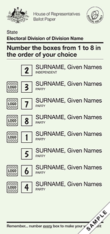
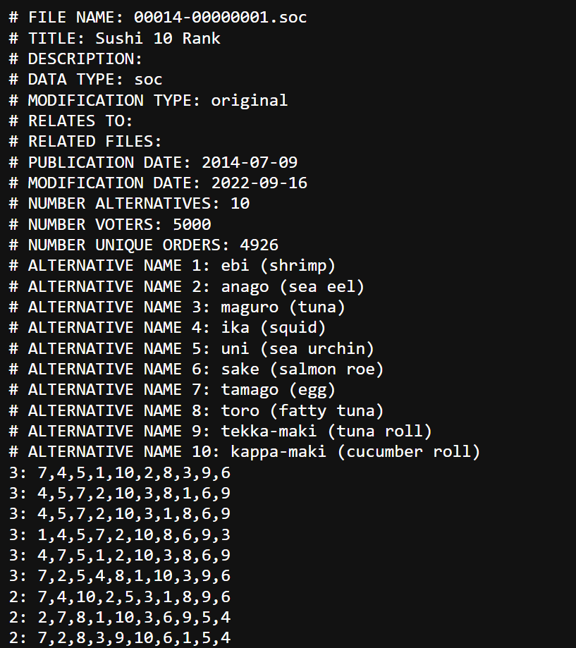
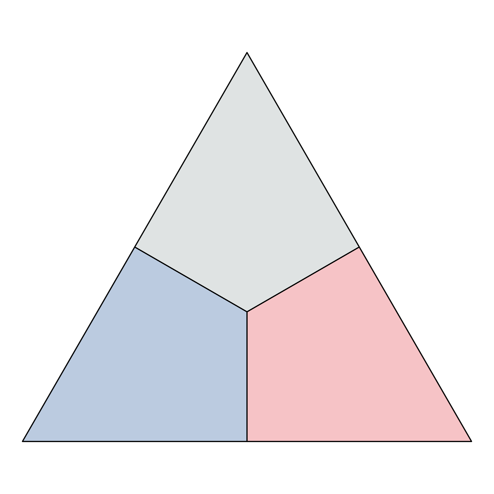
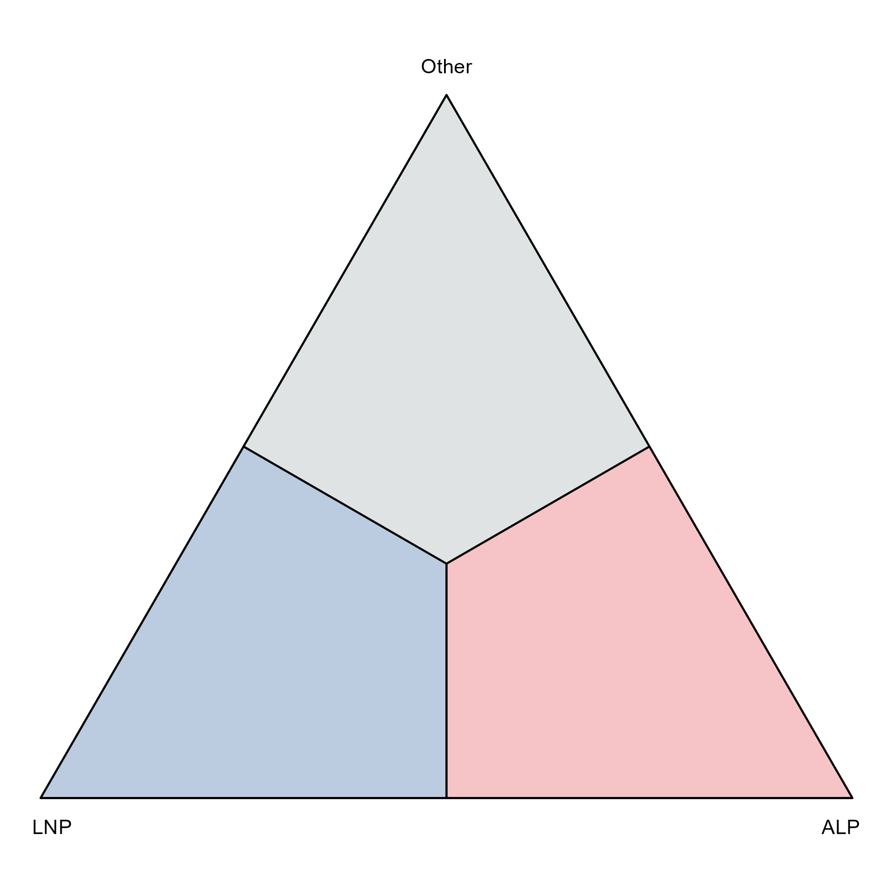
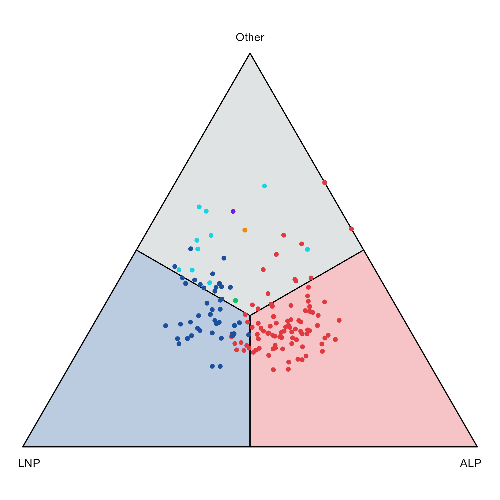

---
format:
  revealjs:
    embed-resources: true
    theme: default
    slide-number: true
    scrollable: false
    fontsize: 30px
    progress: true
    code-line-numbers: true
    footer: "[github.com/numbats/prefviz](https://github.com/numbats/prefviz/)"
    center-title-slide: false
execute:
  echo: false
  warning: false
  message: false
  eval: true
---

```{css}
/*| include: false */

.reveal h1, .reveal h2, .reveal h3 { text-transform: none; }
.reveal h1 { font-size: 1.8em; }
.reveal h2 { font-size: 1.2em; margin-top: 0.3em; }
.reveal pre { width: 100%; font-size: 0.52em; }
.reveal code { padding: 2px 6px; background: rgba(0,0,0,0.08); }
.small-text { font-size: 0.75em; }
.center-slide { text-align: center; }

.highlight-box {
  background: #f0f4ff;
  border-left: 4px solid #1C4F9C;
  padding: 0.6em 1em;
  margin-top: 0.5em;
  border-radius: 4px;
}
.scope-box {
  background: #f8f8f8;
  border: 1px solid #ddd;
  padding: 0.5em 1em;
  border-radius: 4px;
  margin-top: 0.4em;
}
.panel-tabset .nav-link { font-size: 0.85em; }

.code-reveal {
  position: absolute !important;
  top: 20% !important;
  left: 0 !important;
}
```

```{r setup}
#| include: false
library(here)
source(here::here("final_presentation_demo.R"))

library(prefio)
library(prefviz)
library(ggplot2)
library(dplyr)
library(tidyr)
library(tibble)
library(kableExtra)
library(scales)
library(ggiraph)
```

## {data-state="hide-menubar"}


<h1> `prefviz` </h1>

<h2> A visualisation toolkit for preferential election data </h2>

<hr>

<h4> Linh Ngo, Dianne Cook, Damjan Vukcevic </h4>

{.absolute top=295 left=750 width="30%"}


## Preferential data captures rankings, not just first choices

:::: {.columns}

::: {.column width="55%"}

> Preferential data record how people rank alternatives, not just which option they choose first.

::: {.fragment}
**Common contexts:**

- Elections — voters rank candidates
- Consumer surveys — rank products
- Food research — rank dishes, wines, flavours
:::

:::

::: {.column width="45%"}



:::

::::

# Part 2 {.center-slide}

**Motivation**

## Preferential data comes in many shapes...

::: {.columns}

::: {.column width="50%"}

::: {.fragment}

**Wide** — one row per voter

```{r wide-example}
wide_ex <- tibble(
  Member = c("Alice", "Ben", "Carla"),
  `tamago (egg)` = c(1L, 3L, 2L),
  `ebi (shrimp)`    = c(2L, 1L, 3L),
  `anago (sea eel)`  = c(3L, 2L, 1L)
)

kable(wide_ex) |> kable_styling(font_size = 18, full_width = FALSE)
```

:::

::: {.fragment}
**Long** — one row per voter–item pair

```{r long-example}
long_ex <- tibble(
  voter = rep(c("Alice", "Ben", "Carla"), each = 3),
  item  = rep(c("tamago (egg)", "ebi (shrimp)", "anago (sea eel)"), times = 3),
  rank  = c(1L, 2L, 3L, 2L, 1L, 3L, 3L, 2L, 1L)
)
kable(long_ex) |> kable_styling(font_size = 18, full_width = FALSE)
```

:::

:::

::: {.column width="50%" .fragment}

**PrefLib** — encodes all items + a lot more metadata



:::

:::

## And ideally, we want their shapes to be all the same

```{r prefio}
#| echo: true

sushi_data <- prefio::read_preflib(
  "00014 - sushi/00014-00000001.soc",
  from_preflib = TRUE
)
```

```{r prefio-print}
#| echo: false
prefio::read_preflib(
  "00014 - sushi/00014-00000001.soc",
  from_preflib = TRUE
) |> head(5) |>
  kable() |> kable_styling(font_size = 15, full_width = FALSE)
```

## How do we compare first preferences across 150 electorates?

::: {.small-text}
*First-preference votes for ALP, LNP, and Other — 2025 Australian House of Representatives election*
:::

::: {.columns}

::: {.column width="42%" .fragment}

::: {.small-text}
*...150 rows total*
:::


```{r compare-data}
pref25_2d |>
  filter(CountNumber == 0) |>
  select(DivisionNm, ALP, LNP, Other) |>
  head(6) |>
  kable(digits = 2, col.names = c("Electorate", "ALP", "LNP", "Other")) |>
  kable_styling(font_size = 15, full_width = FALSE)
```

:::

::: {.column width="58%" .fragment}

```{r compare-plot}
#| fig-height: 3.8
#| fig-width: 5.5

pref25_2d |>
  filter(CountNumber == 0) |>
  pivot_longer(c(ALP, LNP, Other), names_to = "Party", values_to = "Share") |>
  ggplot(aes(x = reorder(DivisionNm, -Share), y = Share, fill = Party)) +
  geom_col(position = "stack", width = 0.8) +
  scale_fill_manual(values = c("ALP" = "#E13940", "LNP" = "#1C4F9C", "Other" = "#95A5A6")) +
  theme_minimal() +
  theme(
    axis.text.x  = element_blank(),
    axis.ticks.x = element_blank(),
    legend.position = "bottom"
  ) +
  labs(x = "150 electorates", y = "Vote share", fill = NULL,
       title = "150 groups × 3 parties")
```

:::

:::

# Part 4 {.center-slide}

**Case study: 2025 Australian House of Representatives**

## 2025 Australian House of Representatives

::: {.fragment}
**The data:**

- 150 electoral divisions, 28 parties, 6 parties won seats
- Major parties: **Labor (ALP)** & **Liberal–National (LNP)**
- Growing interest: **Greens (GRN)** & **Independents (IND)**
:::

::: {.fragment}
**Three questions this case study explores:**

1. How is the first-preference vote distributed across the two major parties across 150 electorates?
2. For selected electorates, how do preference shares shift through IRV counting rounds?
3. What additional structure is revealed when Greens and Independents are separated from "Others"?
:::

## Transform the data

:::: {.columns}

::: {.column width="50%"}

::: {.fragment}

**Raw data**

```{r show-raw}
#| echo: true
#| code-fold: true
prefviz::aecdop_2025 |>
  select(DivisionNm, CountNumber, PartyAb,
         CalculationType, CalculationValue, Elected) |>
  filter(CalculationType == "Preference Percent") |>
  head()
```

:::

:::

::: {.column width="50%"}

::: {.fragment}

**Transformed data**

```{r show-transform}
#| echo: true
#| eval: false
#| code-fold: true

pref25_2d <- dop_transform(
  data              = aecdop_2025,
  key_cols          = c(DivisionNm, CountNumber),
  value_col         = CalculationValue,
  item_col          = PartyAb,
  winner_col        = Elected,
  winner_identifier = "Y"
)
```

```{r}
#| echo: false

pref25_2d |>
  select(-pref1_party, -true_winner)
```

:::

:::

::::

## First preferences across 150 electorates (1/2) {.smaller}

```{r}
p2d_scatter_interactive 
```

## First preferences across 150 electorates (2/2) {.smaller}

:::{.columns}

:::{.column width="50%"}

:::{.fragment fragment-index=1 .code-reveal}
```{r}
#| echo: true
#| eval: false
ggplot(
  input_data |> filter(CountNumber == 0), 
  aes(x = x1, y = x2)) +
  add_ternary_base() +
```

:::

:::{.fragment fragment-index=2 .code-reveal}
```{r}
#| echo: true
#| eval: false
  geom_ternary_region(
    aes(fill = after_stat(vertex_labels)), 
    vertex_labels = tern_2d$vertex_labels, 
    alpha = 0.3, color = NA, show.legend = FALSE) +
```

:::

:::{.fragment fragment-index=3 .code-reveal}
```{r}
#| echo: true
#| eval: false
  add_vertex_labels(tern_2d$simplex_vertices) +

```
:::

:::{.fragment fragment-index=4 .code-reveal}
```{r}
#| echo: true
#| eval: false
  geom_point(aes(color = Winner))
```
:::

:::

:::{.column width="50%"}

:::{.r-stack}
{.fragment fragment-index=1}

{.fragment fragment-index=2}

{.fragment fragment-index=3}

{.fragment fragment-index=4}
:::

:::

:::

::: {.notes}
- Each region is labelled by the party dominating that vertex: ALP (left), LNP (right), Other (top)
- Points near a vertex = strong first-preference vote for that party; central points = split across parties
- Most electorates cluster in the centre-left (ALP/LNP territory) — very few have a strong Other share
- Points coloured by the *winning* party, not the leading first-preference party
- Key observation: electorates in the Other region still end up electing ALP or LNP — but an ALP/LNP first-preference never flips to the other side
- Question for the audience: how does an electorate with a majority Other first preference end up with an ALP or LNP winner?
:::

## How do preference shares shift through counting rounds? {.smaller}

```{r flow-code}
#| echo: true
#| code-fold: true
#| eval: false
#| code-line-numbers: "1-3|7-9"

path_input <- input_data |>
  filter(DivisionNm %in% c("Fowler", "Melbourne", "Richmond")) |>
  mutate(text = paste0("Round: ", CountNumber, "\n", text))

ggplot(path_input, aes(x = x1, y = x2)) +
  ...
  stat_ordered_path(
    aes(group = DivisionNm, order_by = CountNumber, color = DivisionNm),
    linewidth = 0.5) +
  geom_point_interactive(aes(color = DivisionNm, tooltip = text, data_id = DivisionNm)) +
  ...
```


```{r flow-plot}
#| echo: false
#| fig-align: center
#| fig-height: 5

p2d_line_interactive
```


::: {.notes}
- Each line traces one electorate's path through ternary space as candidates are eliminated round by round
- Round 0 = first-preference shares; final round = two-candidate preferred (2CP)
- Fowler starts deep in the Other region (large independent/minor vote) but moves toward ALP as preferences flow
- Monash moves from a more balanced position toward LNP dominance at the 2CP stage
- The path shows *how* preferences flow, not just where they end up — the ternary captures the full compositional journey
:::

## What additional structure is revealed when Greens and Independents are separated from "Others"? {.smaller}

::: {.panel-tabset}

## Plot

```{r detourr-plot}
detour_scatter
```

## Code

```{r detourr-code}
#| echo: true
#| eval: false
#| code-line-numbers: "1-4|6-7|9-18"

tern_hd <- as_ternable(
  pref25_hd_all |> filter(CountNumber == 0),
  items = c(ALP, LNP, GRN, IND, Other)
)

dtour_data <- get_tern_datahd(tern_hd) |>
  mutate(Winner = factor(coalesce(Winner, labels), levels = names(party_colors)))

detour(dtour_data,
       tour_aes(projection = x1:x4,
                colour = Winner,
                labels = text)) |>
  tour_path(planned_tour(lt), fps = 60) |>
  show_scatter(
    axes    = FALSE,
    palette = party_colors,
    edges   = get_tern_edges(tern_hd),
    size    = 1)
```

:::

::: {.notes}
- With 5 parties the composition lives on a 4-simplex — unrepresentable in 2D directly
- A grand tour projects this 4D object into 2D through a continuous sequence of rotations
- The simplex edges (the skeleton of the 4-simplex) help anchor orientation as the tour rotates
- Watch for clusters: ALP and LNP electorates separate clearly; GRN electorates form a distinct cluster
- IND electorates tend to lie between ALP/GRN and the Other vertex — structurally different from minor-party "Others"
:::

# Part 5 {.center-slide}

**More things you can do with `prefviz`**

## Distribution of preferences bar chart - `dop_bar`

```{r dop-bar-plot}
#| fig-align: center
#| fig-height: 4.2
#| echo: true
#| code-fold: true

sushi_data <- prefio::read_preflib(
  "00014 - sushi/00014-00000001.soc",
  from_preflib = TRUE
)

irv_tbl <- dop_irv(
  sushi_data,
  value_type = "percent",
  preferences_col = preferences,
  frequency_col = frequency
)

dop_bar(irv_tbl, items = -c(round, winner), at_round = 1)
```

## Pairwise comparison — `pairwise_heatmap` {.smaller}

::: {.small-text}
If we pick out 2 random items and look at their relative positions on the ballot, which one would win?
:::

```{r pairwise-plot}
#| echo: true
#| code-fold: true
#| fig-align: center

sushi_data <- prefio::read_preflib(
  "00014 - sushi/00014-00000001.soc",
  from_preflib = TRUE
)

pw_result <- pairwise_calculator(
  sushi_data,
  preferences_col = preferences,
  frequency_col   = frequency
)

pairwise_heatmap(pw_result, value = "tcp")
```

*Each cell shows the proportion of ballots that preferred row item over column item.*

*Diagonal = 50% (item vs itself); values > 50% indicate the row item is more often preferred.*

## Limitations and Next steps

:::: {.columns}

::: {.column width="50%"}

**Limitations**

- 2D plots lack visual aids such as axis ticks, reference lines, and axis labels to help orient the viewer
- Precise projections for HD plots to observe all pairwise compositions need mathematical computation

:::

::: {.column width="50%"}

**Next steps**

- Website refresh for version 0.1.2
- Submit a software paper to *R Journal*

:::

::::