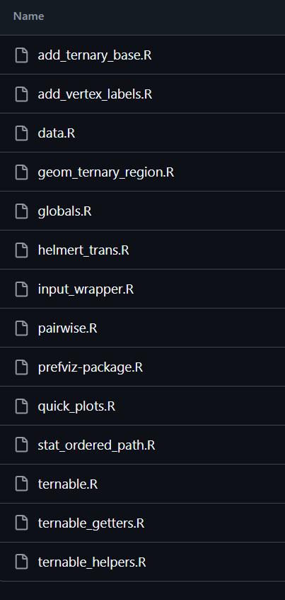
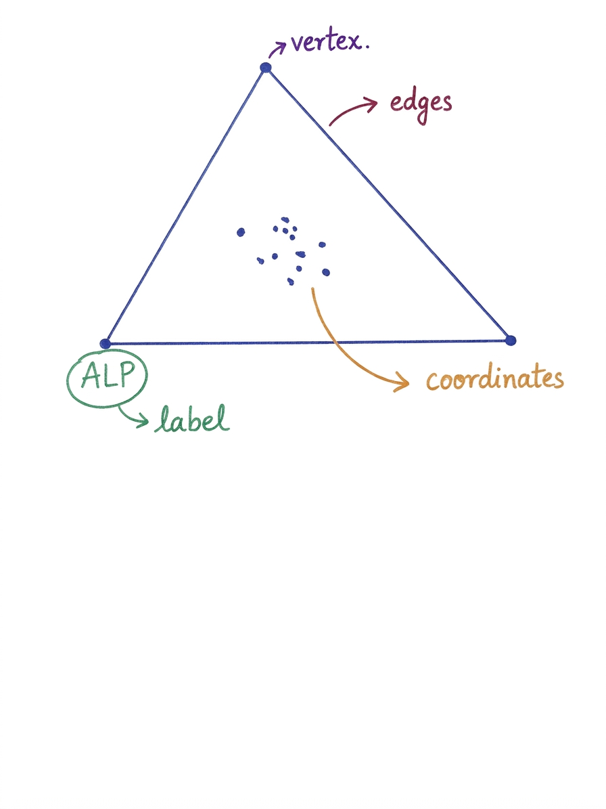

```{css}
/*| include: false */

.reveal h1, .reveal h2, .reveal h3 { text-transform: none; }
.reveal h1 { font-size: 2em; }
.reveal h2 { font-size: 1.4em; margin-top: 0.3em; }
.reveal pre { width: 100%; font-size: 0.52em; }
.reveal code { padding: 2px 6px; background: rgba(0,0,0,0.08); }
.small-text { font-size: 0.75em; }
.center-slide { text-align: center; }

.highlight-box {
  background: #f0f4ff;
  border-left: 4px solid #1C4F9C;
  padding: 0.6em 1em;
  margin-top: 0.5em;
  border-radius: 4px;
}
.scope-box {
  background: #f8f8f8;
  border: 1px solid #ddd;
  padding: 0.5em 1em;
  border-radius: 4px;
  margin-top: 0.4em;
}
.panel-tabset .nav-link { font-size: 0.85em; }
```

```{r setup}
#| include: false
library(here)
source(here::here("package_demo.R"))

library(prefio)
library(prefviz)
library(ggplot2)
library(dplyr)
library(tibble)
library(kableExtra)
library(scales)
library(ggiraph)
```

## Seeking feedbacks

1. **Presentation:** Any parts you wish to get more explanations or Any redundant parts?
2. **Applications:** Is there any use cases you think would be interesting to explore?

# Part 1 {.center-slide}

**What is preferential data?**

## Data that captures rankings, not just first choices

:::: {.columns}

::: {.column width="55%"}

> Preferential data record how people rank alternatives, not just which option they choose first.

::: {.fragment}
**Common contexts:**

- Elections — voters rank candidates
- Consumer surveys — rank products
- Food research — rank dishes, wines, flavours
:::

:::

::: {.column width="45%"}


:::

::::

# Part 2 {.center-slide}

**Forms of preferential data**

 

## The same rankings can be stored in multiple shapes

:::: {.columns}

::: {.column width="50%"}

**Wide** — one row per voter

```{r wide-example}
wide_ex <- tibble(
  Voter = c("Alice", "Ben", "Carla"),
  `1st` = c("Coffee", "Coke", "OJ"),
  `2nd` = c("Coke", "OJ", "Coffee"),
  `3rd` = c("OJ", "Coffee", "Coke")
)
kable(wide_ex) |> kable_styling(font_size = 18, full_width = FALSE)
```

:::

::: {.column width="50%" .fragment}

**Long** — one row per voter–item pair

```{r long-example}
long_ex <- tibble(
  voter = rep(c("Alice", "Ben", "Carla"), each = 3),
  item  = rep(c("Coffee", "Coke", "OJ"), times = 3),
  rank  = c(1L, 2L, 3L, 2L, 1L, 3L, 3L, 2L, 1L)
)
kable(long_ex) |> kable_styling(font_size = 18, full_width = FALSE)
```

:::

::::

## PrefLib — a standard format for ranked data

:::: {.columns}

::: {.column width="55%"}


:::

::: {.column width="45%"}

::: {.fragment}
Ranked datasets exist in **structured exchange formats** beyond rectangular tables.

Each line presents 1 ballot, with the numbers corresponding to their corresponding alternatives/items.

:::

::: {.fragment}
::: {.highlight-box}
**Adopt `prefio` as the tidy approach.**

Read PrefLib files, convert between forms, aggregate ballot counts — use **`prefio`**.
:::
:::

:::

::::


# Part 3 {.center-slide}

**Visualisation for preferential data**

## Scope: exploratory analysis, not model output

:::: {.columns}

::: {.column width="55%"}

::: {.fragment}
::: {.scope-box}
**Covered**

Inspecting the **structure of raw preferential data** — before or alongside modelling.
:::
:::

::: {.fragment}
::: {.scope-box}
**Not covered**

Visualising outputs from preference models (mixed logit, Bradley–Terry, Plackett–Luce, ...).
:::
:::

:::

::: {.column width="45%"}

::: {.fragment}
**Two organising questions:**

1. What are the **general preferences** in the data?

2. How do we **compare multiple elections** or preference contexts?
:::

:::

::::

## Pairwise comparison — `pairwise_heatmap`

::: {.small-text}
*Data: 5000 respondents ranking 10 sushi types (PrefLib)*
:::

::: {.panel-tabset}

## Plot

```{r pairwise-plot}
#| fig-align: center
#| fig-height: 4.2

# Read preflib data to a tibble with `prefio`
sushi_data <- prefio::read_preflib(
  "00014 - sushi/00014-00000001.soc",
  from_preflib = TRUE
)

# Compute pairwise
pw_result <- pairwise_calculator(
  sushi_data,
  preferences_col = preferences,
  frequency_col   = frequency
)

# Plot heat map
pairwise_heatmap(pw_result, value = "tcp")
```

## Code

```{r pairwise-code}
#| echo: true
#| eval: false

sushi_data <- prefio::read_preflib(
  "00014 - sushi/00014-00000001.soc",
  from_preflib = TRUE
)

pw_result <- pairwise_calculator(
  sushi_data,
  preferences_col = preferences,
  frequency_col   = frequency
)

pairwise_heatmap(pw_result, value = "tcp")
```

:::

## Distribution of preference — `dop_bar`

::: {.small-text}
*Data: 5000 respondents ranking 10 sushi types (PrefLib)*
:::

::: {.panel-tabset}

## Plot

```{r dop-bar-plot}
#| fig-align: center
#| fig-height: 4.2
irv_tbl <- dop_irv(sushi_data, value_type = "percent", preferences_col = preferences, frequency_col = frequency)
dop_bar(irv_tbl, -c(round, winner), at_round = 1)
```

## Code

```{r dop-bar-code}
#| echo: true
#| eval: false

# Compute the IRV rounds
irv_tbl <- dop_irv(
  sushi_data,
  value_type      = "percent",
  preferences_col = preferences,
  frequency_col   = frequency
)

# Plot
dop_bar(irv_tbl, -c(round, winner), at_round = 1)
```

:::

## Ternary plots — all electorates at once

::: {.small-text}
A stepping stone from simple summaries to higher-dimensional exploration
:::

::: {.panel-tabset}

## Plot

```{r ternary-intro-plot}
#| fig-align: center
#| fig-height: 4.2

ggplot(input_p2d_base, aes(x = x1, y = x2)) +
  add_ternary_base() +
  geom_ternary_region(
    x1 = 1/3, x2 = 1/3, x3 = 1/3,
    aes(fill = after_stat(vertex_labels)),
    vertex_labels = tern_2d$vertex_labels,
    alpha = 0.25, color = NA, show.legend = FALSE
  ) +
  add_vertex_labels(tern_2d$simplex_vertices) +
  geom_point(aes(color = Winner), size = 1.8, alpha = 0.85) +
  scale_fill_manual(
    values = c("ALP" = "#E13940", "LNP" = "#1C4F9C", "Other" = "#95A5A6")
  ) +
  scale_color_manual(values = party_colors, name = "Elected") +
  labs(title = "First preference — 2025 Australian Federal Election") +
  theme_void() +
  theme(legend.position = "bottom", legend.text = element_text(size = 11))
```

## Code

```{r ternary-intro-code}
#| echo: true
#| eval: false

tern_2d <- as_ternable(pref25_2d, items = ALP:Other)

input_data <- get_tern_data(tern_2d, plot_type = "2D")

ggplot(input_data |> filter(CountNumber == 0),
       aes(x = x1, y = x2)) +
  add_ternary_base() +
  geom_ternary_region(
    x1 = 1/3, x2 = 1/3, x3 = 1/3,
    aes(fill = after_stat(vertex_labels)),
    vertex_labels = tern_2d$vertex_labels,
    alpha = 0.3, color = NA) +
  add_vertex_labels(tern_2d$simplex_vertices) +
  geom_point(aes(color = Winner)) +
  scale_color_manual(values = party_colors)
```

:::

## Ternary path — tracking one observation across rounds

::: {.small-text}
*How a single electorate's composition shifts as candidates are eliminated*
:::

```{r single-path-plot}
#| fig-align: center
#| fig-height: 4.2

single_path <- input_data |>
  filter(DivisionNm == "Hotham") |>
  mutate(label = if_else(
    CountNumber == 0, "Round 1\n(first pref)",
    if_else(CountNumber == max(CountNumber), "Final\n(2CP)", NA_character_)
  ))

ggplot(single_path, aes(x = x1, y = x2)) +
  add_ternary_base() +
  geom_ternary_region(
    x1 = 1/3, x2 = 1/3, x3 = 1/3,
    aes(fill = after_stat(vertex_labels)),
    vertex_labels = tern_2d$vertex_labels,
    alpha = 0.2, color = NA, show.legend = FALSE
  ) +
  add_vertex_labels(tern_2d$simplex_vertices) +
  stat_ordered_path(
    aes(order_by = CountNumber),
    color = "#555", line.width = 0.8
  ) +
  geom_point_interactive(
    aes(color   = pref1_party,
        tooltip = text,
        data_id = DivisionNm)) +
  ggrepel::geom_label_repel(
    aes(label = label), size = 3, na.rm = TRUE,
    nudge_y = 0.04, segment.size = 0.3
  ) +
  scale_fill_manual(
    values = c("ALP" = "#E13940", "LNP" = "#1C4F9C", "Other" = "#95A5A6")
  ) +
  scale_color_manual(values = party_colors, name = "Leading party") +
  labs(title = "Hotham — preference flow across counting rounds") +
  theme_void() +
  theme(legend.position = "bottom", legend.text = element_text(size = 10))
```


## How to read ternary plot

:::: {.columns}

::: {.column width="55%"}

```{r ternary-explainer}
#| fig-height: 4.5
#| fig-width: 5

strong_alp   <- input_p2d_base |> arrange(desc(ALP))   |> slice(1)
strong_lnp   <- input_p2d_base |> arrange(desc(LNP))   |> slice(1)
strong_other <- input_p2d_base |> arrange(desc(Other)) |> slice(1)
center_pt <- data.frame(
  x1 = mean(tern_2d$simplex_vertices$x1),
  x2 = mean(tern_2d$simplex_vertices$x2)
)

ggplot(input_p2d_base, aes(x = x1, y = x2)) +
  add_ternary_base() +
  geom_ternary_region(
    x1 = 1/3, x2 = 1/3, x3 = 1/3,
    aes(fill = after_stat(vertex_labels)),
    vertex_labels = tern_2d$vertex_labels,
    alpha = 0.25, color = NA, show.legend = FALSE
  ) +
  add_vertex_labels(tern_2d$simplex_vertices) +
  scale_fill_manual(
    values = c("ALP" = "#E13940", "LNP" = "#1C4F9C", "Other" = "#95A5A6")
  ) +
  theme_void() +
  geom_point(data = strong_alp,   size = 4, color = "#E13940") +
  geom_point(data = strong_lnp,   size = 4, color = "#1C4F9C") +
  geom_point(data = strong_other, size = 4, color = "#10C25B") +
  geom_point(data = center_pt, size = 5, color = "#8E44AD", shape = 18) +
  annotate("text", x = strong_alp$x1,   y = strong_alp$x2 - 0.05,
           label = "Sydney (ALP: 55.1%)",    color = "#E13940", size = 3, fontface = "bold") +
  annotate("text", x = strong_lnp$x1,   y = strong_lnp$x2 - 0.05,
           label = "Mananoa (LNP: 53.2%)",  color = "#1C4F9C", size = 3, fontface = "bold") +
  annotate("text", x = strong_other$x1, y = strong_other$x2 + 0.05,
           label = "Solomon (Other: 67.2%)", color = "#10C25B", size = 3, fontface = "bold") +
  annotate("text", x = center_pt$x1, y = center_pt$x2 + 0.05,
           label = "Centre (33% each)", color = "#8E44AD", size = 3, fontface = "bold")
```

:::

::: {.column width="45%"}

::: {.incremental}
- Each **dot** = one electorate
- Three components: **ALP %, LNP %, Other %**
- All 150 electorates visible **at once**
- Position in the triangle encodes composition
:::

:::

::::

# Part 4 {.center-slide}

**Case study: Australian House of Representatives**

## Package code structure

{fig-align="center" width="85%"}

## Main functions

```{r fn-table}
fn_tbl <- tibble::tribble(
  ~Function,                              ~Description,
  "as_ternable(data, items)",             "Create a ternable object that stores all simplex components",
  "get_tern_data2d(tern)",       "Extract 2D / HD projected coordinates",
  "get_tern_edges(tern)",                 "Get simplex edge pairs for tour overlays",
  "get_tern_labels(tern)",                "Get vertex label strings",
  "add_ternary_base()",                   "Draw the triangle frame",
  "geom_ternary_region(...)",             "Fill coloured regions per party",
  "add_vertex_labels(vertices)",          "Add party labels at corners",
  "stat_ordered_path(...)",               "Draw preference-flow paths",
  "dop_irv(data, ...)",                   "Compute IRV rounds from ranked ballots",
  "pairwise_calculator(data, ...)",       "Compute all pairwise win proportions",
  "dop_bar(irv_tbl, ..., at_round)",      "Bar chart of preference distribution at a round",
  "pairwise_heatmap(pw, value)",          "Heatmap of two-candidate preferred margins"
)

kable(fn_tbl, col.names = c("Function", "Description")) |>
  kable_styling(font_size = 15, full_width = TRUE) |>
  pack_rows("Ternable object", 1, 4, color = "#1C4F9C", background = "#f0f4ff", bold = FALSE) |>
  pack_rows("ggplot2 extensions for ternary plots", 5, 8, color = "#1C4F9C", background = "#f0f4ff", bold = FALSE) |>
  pack_rows("Election calculators", 9, 10, color = "#1C4F9C", background = "#f0f4ff", bold = FALSE) |>
  pack_rows("Quick plots", 11, 12, color = "#1C4F9C", background = "#f0f4ff", bold = FALSE)
```

## `ternable` object

:::: {.columns}

::: {.column width="55%"}

A `ternable` object contains the data and metadata necessary for ternary plots, including the **vertices, edges, labels** of the simplex, and **coordinates** of all data points.

```{r step2}
#| echo: true
#| code-fold: false

tern_2d <- as_ternable(pref25_2d, items = ALP:Other)
```

::: {.incremental}
- **`ternary_coords`** - coordinates of all data points
- **`simplex_vertices`** - coordinates of the 3 corners
- **`simplex_edges`** - pairs connecting vertices
- **`vertex_labels`** - party names at each corner

:::

:::

::: {.column width="45%"}



:::

::::

## First preference distribution {.smaller}

::: {.panel-tabset}

## Plot

```{r aec-fp-plot}
#| fig-align: center
#| fig-height: 4.2

long_df <- aecdop_2022 |>
  dplyr::filter(
    CalculationType == "Preference Percent",
    CountNumber == 0,
    DivisionNm == "Adelaide"
  )
dop_bar(long_df, items = PartyAb, value_col = CalculationValue,
       round_col = "CountNumber", at_round = 0)
```

## Code

```{r aec-fp-code}
#| echo: true
#| eval: false
#| code-line-numbers: "1-13|15-24"

long_df <- aecdop_2022 |>
  dplyr::filter(
    CalculationType == "Preference Percent",
    CountNumber == 0
  )
dop_bar(long_df, items = PartyAb, value_col = CalculationValue,
       round_col = "CountNumber", at_round = 0)
```

:::

## Multiple electorates at once — ternary plot {.smaller}

::: {.panel-tabset}

## Plot

```{r ternary-interactive-plot}
p2d_interactive
```

## Code

```{r ternary-interactive-code}
#| echo: true
#| eval: false
#| code-line-numbers: "1-9|11-12|14-15|17-27"

pref25_2d <- dop_transform(
  data              = pref25_2d,
  key_cols          = c(DivisionNm, CountNumber),
  value_col         = CalculationValue,
  item_col          = Party,
  winner_col        = Elected,
  winner_identifier = "Y"
)

tern_2d <- as_ternable(pref25_2d, items = ALP:Other)

input_data <- get_tern_data(tern_2d, plot_type = "2D")

ggplot(input_data |> filter(CountNumber == 0),
       aes(x = x1, y = x2)) +
  add_ternary_base() +
  geom_ternary_region(
    aes(fill = after_stat(vertex_labels)),
    vertex_labels = tern_2d$vertex_labels,
    alpha = 0.3, color = NA) +
  add_vertex_labels(tern_2d$simplex_vertices) +
  geom_point_interactive(
    aes(color = Winner, tooltip = text,
        data_id = DivisionNm))
```

:::

 

## Flow of preference — path through ternary space {.smaller}

::: {.panel-tabset}

## Plot

```{r flow-plot}
p2d_line_interactive
```

## Code

```{r flow-code}
#| echo: true
#| eval: false
#| code-line-numbers: "1-3|5-12|13-17|18-22"

line_input <- input_data |>
  filter(DivisionNm %in% c("Hotham", "Fowler", "Monash"))

ggplot(line_input, aes(x = x1, y = x2)) +
  add_ternary_base() +
  geom_ternary_region(
    aes(fill = after_stat(vertex_labels)),
    vertex_labels = tern_2d$vertex_labels,
    alpha = 0.3, color = "grey50") +
  add_vertex_labels(tern_2d$simplex_vertices) +
  stat_ordered_path(
    aes(group    = DivisionNm,
        order_by = CountNumber,
        color    = Winner),
    line.width = 0.5) +
  geom_point_interactive(
    aes(color   = pref1_party,
        tooltip = text,
        data_id = DivisionNm))
```

:::

 

## Higher dimensions — `detourr` + `tourr` {.smaller}

::: {.panel-tabset}

## Plot

```{r detourr-plot}
de
```

## Code

```{r detourr-code}
#| echo: true
#| eval: false
#| code-line-numbers: "1-2|4-8|10-20"

tern_hd <- as_ternable(pref25_hd, items = ALP:IND)

dtour_data <- tern_hd$simplex_vertices |>
  mutate(Winner = labels) |>
  bind_rows(get_tern_data(tern_hd, plot_type = "2D"))

detour(dtour_data,
       tour_aes(projection = x1:x4,
                colour = Winner,
                label  = text)) |>
  tour_path(grand_tour(3), fps = 60) |>
  show_scatter(
    axes    = FALSE,
    palette = party_colors,
    edges   = get_tern_edges(tern_hd),
    size    = 1.5)
```

:::